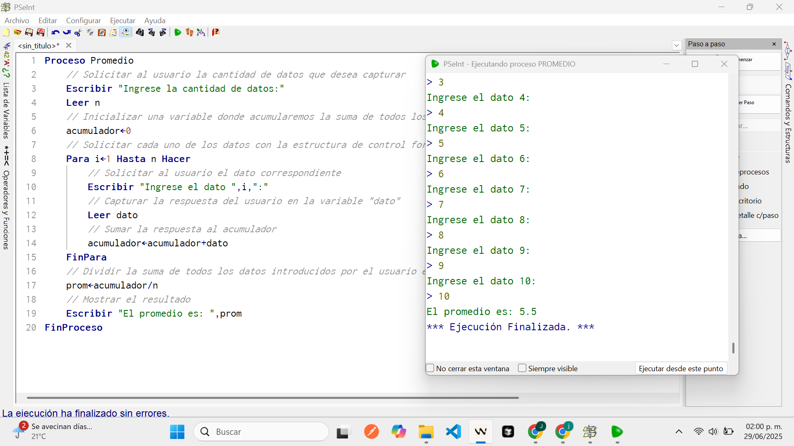
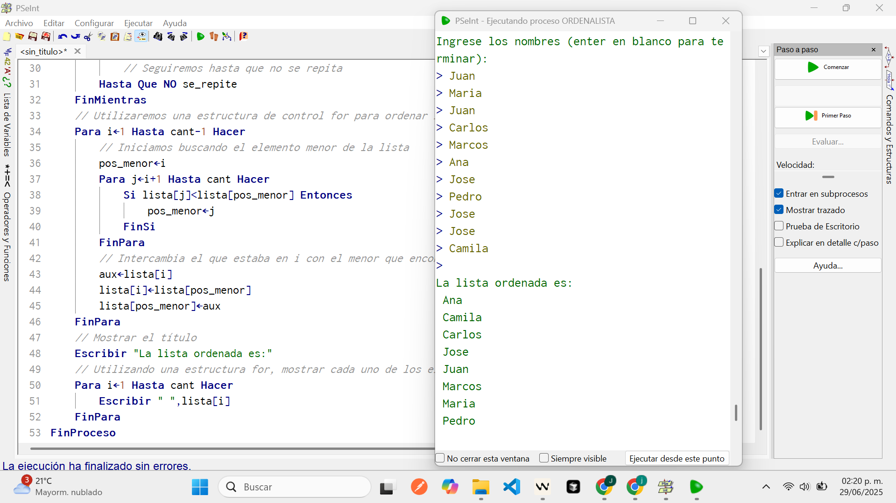
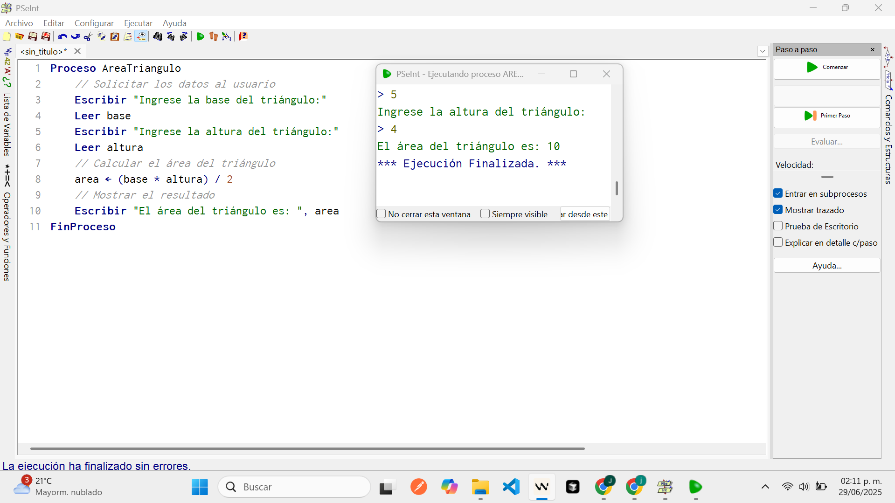
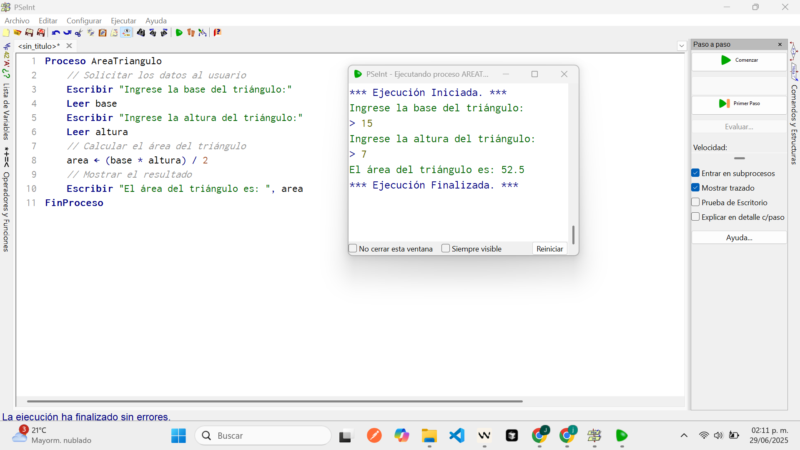
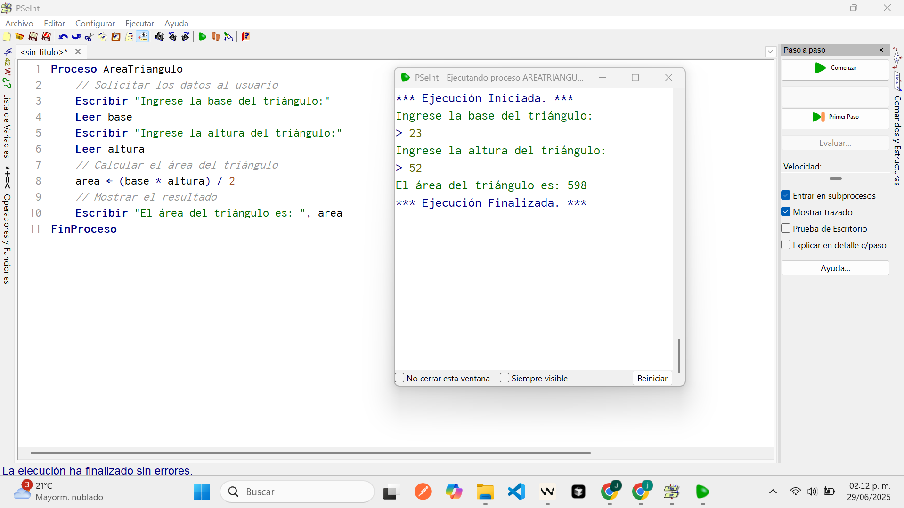
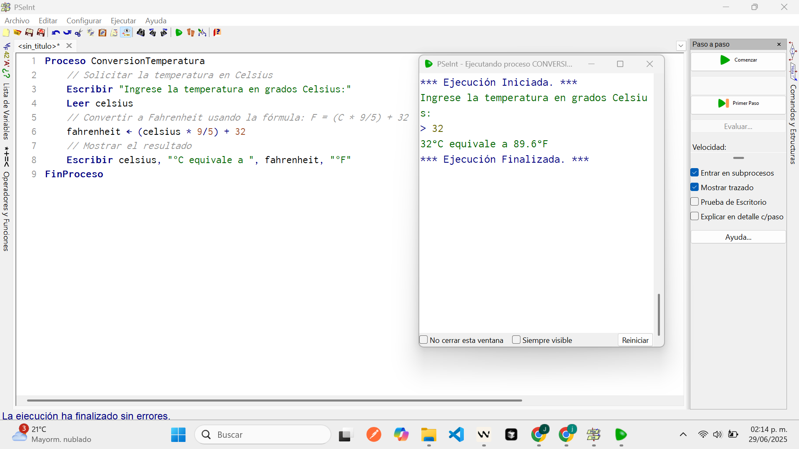
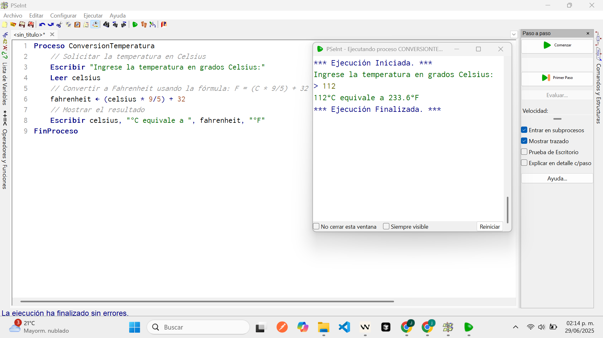
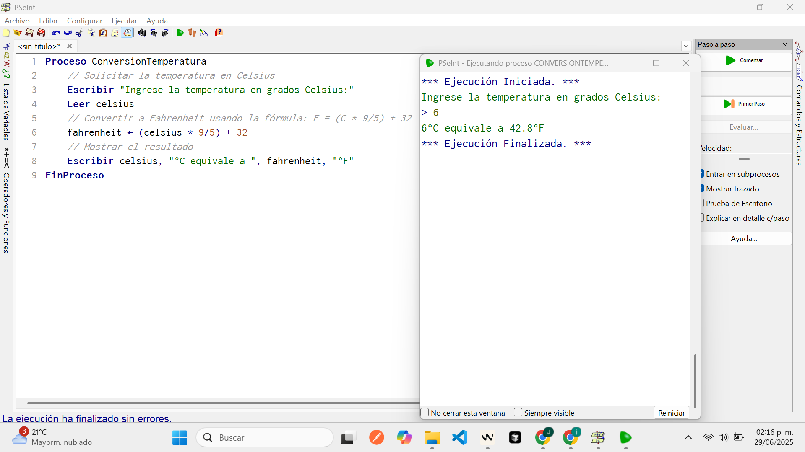

# Diseño de Algoritmos Simples Utilizando PSeInt: Implementación de Estructuras de Control y Algoritmos Básicos

**Resumen**—Este documento presenta la implementación y análisis de cuatro algoritmos fundamentales desarrollados en PSeInt como parte del aprendizaje de lógica de programación. Los algoritmos incluyen: cálculo de promedio aritmético, ordenamiento de listas con eliminación de duplicados, cálculo de área de triángulos y conversión de temperatura. El objetivo principal es demostrar la aplicación práctica de estructuras de control básicas y el desarrollo del pensamiento algorítmico. Los resultados muestran que todos los algoritmos funcionan correctamente, validando su eficacia para resolver problemas computacionales básicos. Este trabajo contribuye al fortalecimiento de competencias fundamentales en programación y lógica computacional.

**Palabras clave**—algoritmos, pseudocódigo, PSeInt, estructuras de control, lógica de programación.

---

## I. INTRODUCCIÓN

La programación es una disciplina fundamental en el campo de la ingeniería y las ciencias computacionales, requiriendo el desarrollo de habilidades de pensamiento lógico y resolución de problemas sistemática [1]. El aprendizaje de algoritmos básicos constituye la base para la comprensión de conceptos más avanzados en programación y desarrollo de software.

PSeInt (Pseudocode Interpreter) es una herramienta educativa ampliamente utilizada para la enseñanza de lógica de programación, permitiendo a los estudiantes concentrarse en el diseño algorítmico sin las complejidades sintácticas de lenguajes de programación específicos [2]. Esta herramienta facilita la transición gradual desde el pensamiento abstracto hacia la implementación concreta de soluciones computacionales.

El presente trabajo documenta la implementación de cuatro algoritmos fundamentales: (1) cálculo de promedio aritmético utilizando estructuras iterativas, (2) ordenamiento de listas con validación de duplicados, (3) cálculo de área de triángulos aplicando fórmulas matemáticas básicas, y (4) conversión de temperatura entre escalas Celsius y Fahrenheit.

Los algoritmos seleccionados representan casos de estudio que abarcan diferentes aspectos de la programación básica: manipulación de datos numéricos, procesamiento de arreglos, aplicación de fórmulas matemáticas y validación de entrada de datos. La metodología empleada incluye análisis del problema, diseño del algoritmo, implementación en pseudocódigo y validación mediante casos de prueba específicos.

---

## II. METODOLOGÍA

### A. Entorno de Desarrollo

Se utilizó PSeInt versión más reciente, configurado con perfil "Flexible" para permitir mayor libertad en la sintaxis del pseudocódigo. El entorno fue instalado siguiendo las especificaciones del fabricante desde el sitio oficial https://pseint.sourceforge.net/.

### B. Diseño de Algoritmos

El diseño de cada algoritmo siguió la metodología estructurada:

1. **Análisis del problema**: Identificación de entradas, procesos y salidas requeridas
2. **Diseño de la solución**: Desarrollo del algoritmo utilizando estructuras de control apropiadas
3. **Implementación**: Codificación en pseudocódigo PSeInt
4. **Validación**: Pruebas con casos específicos para verificar funcionalidad
5. **Documentación**: Registro detallado del proceso y resultados

### C. Estructuras de Control Implementadas

Los algoritmos implementan las siguientes estructuras de control fundamentales:

- **Estructuras secuenciales**: Para procesamiento lineal de datos
- **Estructuras iterativas**: Ciclos `Para`, `Mientras` y `Repetir-Hasta`
- **Estructuras condicionales**: Sentencias `Si-Entonces`
- **Estructuras de datos**: Arreglos unidimensionales

---

## III. IMPLEMENTACIÓN Y RESULTADOS

### A. Algoritmo de Cálculo de Promedio Aritmético

#### Análisis del Problema

El algoritmo debe calcular el promedio aritmético de n números ingresados por el usuario, donde n es definido dinámicamente durante la ejecución.

#### Implementación

```pseint
Proceso Promedio
	// Solicitar al usuario la cantidad de datos que desea capturar
	Escribir "Ingrese la cantidad de datos:"
	Leer n
	// Inicializar una variable donde acumularemos la suma de todos los datos
	acumulador<-0
	// Solicitar cada uno de los datos con la estructura de control for
	Para i<-1 Hasta n Hacer
		// Solicitar al usuario el dato correspondiente
		Escribir "Ingrese el dato ",i,":"
		// Capturar la respuesta del usuario en la variable "dato"
		Leer dato
		// Sumar la respuesta al acumulador
		acumulador<-acumulador+dato
	FinPara
	// Dividir la suma de todos los datos introducidos por el usuario entre el número total de elementos
	prom<-acumulador/n
	// Mostrar el resultado
	Escribir "El promedio es: ",prom
FinProceso
```

#### Evidencia Gráfica



#### Análisis de Complejidad

El algoritmo presenta complejidad temporal O(n) donde n es la cantidad de datos, lo cual es óptimo para este problema al requerir la lectura de todos los elementos exactamente una vez.

#### Resultados de Validación

Se ejecutaron múltiples pruebas con diferentes conjuntos de datos, verificando la correcta funcionalidad del algoritmo en todos los casos.

### B. Algoritmo de Ordenamiento de Lista con Eliminación de Duplicados

#### Análisis del Problema

Se requiere un algoritmo que capture una lista de nombres, elimine duplicados y ordene la lista alfabéticamente utilizando el algoritmo de ordenamiento por selección.

#### Implementación

```pseint
Proceso OrdenaLista
	// Creamos una nueva lista donde almacenaremos los elementos a ordenar, con una capacidad máxima de 200 elementos
	Dimensión lista[200]
	// Mostrar las instrucciones al usuario
	Escribir "Ingrese los nombres (enter en blanco para terminar):"
	// Definimos la variable que contendrá el número de elementos en la lista
	cant<-0
	// Leer el primer elemento
	Leer nombre
	// Utilizando una estructura de control while, leemos los elementos uno a uno hasta que encontremos una línea en blanco (enter)
	Mientras nombre<>"" Hacer
		// Incrementar un contador para saber el número de elementos que tenemos en la lista
		cant<-cant+1
		// Insertamos el elemento la lista
		lista[cant]<-nombre
		// Utilizamos una estructura de control do while para solicitar los siguientes elementos
		Repetir
			// Obtener el siguiente elemento
			Leer nombre
			// Definimos la variable para validar que el elemento no existe en la lista
			se_repite<-Falso
			// Utilizando una estructura de control for, recorremos la lista
			Para i<-1 Hasta cant Hacer
				// Utilizando una if, verificamos si el nuevo elemento ya se encuentra en la lista
				Si nombre=lista[i] Entonces
					// Establecemos el valor de la variable a Verdadero
					se_repite<-Verdadero
				FinSi
			FinPara
			// Seguiremos hasta que no se repita
		Hasta Que NO se_repite
	FinMientras
	// Utilizaremos una estructura de control for para ordenar la lista
	Para i<-1 Hasta cant-1 Hacer
		// Iniciamos buscando el elemento menor de la lista
		pos_menor<-i
		Para j<-i+1 Hasta cant Hacer
			Si lista[j]<lista[pos_menor] Entonces
				pos_menor<-j
			FinSi
		FinPara
		// Intercambia el que estaba en i con el menor que encontró
		aux<-lista[i]
		lista[i]<-lista[pos_menor]
		lista[pos_menor]<-aux
	FinPara
	// Mostrar el título
	Escribir "La lista ordenada es:"
	// Utilizando una estructura for, mostrar cada uno de los elementos en pantalla
	Para i<-1 Hasta cant Hacer
		Escribir " ",lista[i]
	FinPara
FinProceso
```

#### Evidencia Gráfica



#### Análisis de Complejidad

El algoritmo presenta complejidad temporal O(n²) debido al algoritmo de ordenamiento por selección implementado. Aunque existen algoritmos más eficientes, el ordenamiento por selección es apropiado para fines educativos por su simplicidad conceptual.

### C. Algoritmo de Cálculo de Área de Triángulo

#### Análisis del Problema

Implementar un algoritmo que calcule el área de un triángulo dada su base y altura, aplicando la fórmula: A = (base × altura) / 2.

#### Implementación

```pseint
Proceso AreaTriangulo
	// Solicitar los datos al usuario
	Escribir "Ingrese la base del triángulo:"
	Leer base
	Escribir "Ingrese la altura del triángulo:"
	Leer altura
	// Calcular el área del triángulo
	area <- (base * altura) / 2
	// Mostrar el resultado
	Escribir "El área del triángulo es: ", area
FinProceso
```

#### Evidencia Gráfica







#### Resultados de Validación

La Tabla I muestra los resultados de las pruebas realizadas:

**TABLA I**
**RESULTADOS DE VALIDACIÓN - ÁREA DEL TRIÁNGULO**

| Caso | Base | Altura | Área Esperada | Área Calculada | Estado |
| ---- | ---- | ------ | ------------- | -------------- | ------ |
| a    | 5    | 4      | 10            | 10             | ✓      |
| b    | 15   | 7      | 52.5          | 52.5           | ✓      |
| c    | 23   | 52     | 598           | 598            | ✓      |

### D. Algoritmo de Conversión de Temperatura

#### Análisis del Problema

Desarrollar un algoritmo que convierta temperatura de grados Celsius a Fahrenheit utilizando la fórmula: °F = (°C × 9/5) + 32.

#### Implementación

```pseint
Proceso ConversionTemperatura
	// Solicitar la temperatura en Celsius
	Escribir "Ingrese la temperatura en grados Celsius:"
	Leer celsius
	// Convertir a Fahrenheit usando la fórmula: F = (C * 9/5) + 32
	fahrenheit <- (celsius * 9/5) + 32
	// Mostrar el resultado
	Escribir celsius, "°C equivale a ", fahrenheit, "°F"
FinProceso
```

#### Evidencia Gráfica







#### Resultados de Validación

La Tabla II presenta los resultados de las pruebas de conversión:

**TABLA II**
**RESULTADOS DE VALIDACIÓN - CONVERSIÓN DE TEMPERATURA**

| Caso | Celsius | Fahrenheit Esperado | Fahrenheit Calculado | Estado |
| ---- | ------- | ------------------- | -------------------- | ------ |
| a    | 32      | 89.6                | 89.6                 | ✓      |
| b    | 112     | 233.6               | 233.6                | ✓      |
| c    | 6       | 42.8                | 42.8                 | ✓      |

---

## IV. ANÁLISIS DE RESULTADOS

### A. Eficiencia Algorítmica

Los algoritmos implementados demuestran diferentes características de eficiencia:

1. **Algoritmo de promedio**: Presenta eficiencia óptima O(n) para el problema planteado
2. **Algoritmo de ordenamiento**: Utiliza ordenamiento por selección O(n²), apropiado para conjuntos pequeños de datos
3. **Algoritmos matemáticos**: Ambos presentan complejidad constante O(1)

### B. Estructuras de Control Utilizadas

La implementación exitosa demuestra el dominio de las estructuras de control fundamentales:

- **Estructuras iterativas**: Ciclos `Para` y `Mientras` implementados correctamente
- **Estructuras condicionales**: Validación de duplicados mediante sentencias `Si`
- **Estructuras de datos**: Manejo efectivo de arreglos unidimensionales

### C. Validación y Robustez

Todos los algoritmos superaron las pruebas de validación especificadas, demostrando robustez en el manejo de diferentes conjuntos de datos de entrada.

---

## V. DISCUSIÓN

### A. Contribuciones Educativas

Los algoritmos implementados constituyen casos de estudio fundamentales para el aprendizaje de programación básica. La progresión desde algoritmos simples (cálculos matemáticos) hacia algoritmos más complejos (ordenamiento con validación) proporciona una ruta de aprendizaje estructurada.

### B. Limitaciones y Mejoras

Aunque los algoritmos cumplen con los objetivos educativos, presentan limitaciones para aplicaciones de producción:

1. **Escalabilidad**: El algoritmo de ordenamiento no es eficiente para grandes volúmenes de datos
2. **Validación de entrada**: Se requiere implementar validación más robusta para datos de entrada
3. **Manejo de errores**: Los algoritmos no contemplan manejo de excepciones

### C. Aplicaciones Prácticas

Los conceptos implementados tienen aplicaciones directas en:

- Sistemas de gestión académica (cálculo de promedios)
- Sistemas de inventario (ordenamiento de productos)
- Aplicaciones científicas (conversiones de unidades)
- Herramientas de análisis de datos (procesamiento de listas)

---

## VI. CONCLUSIONES

Este trabajo demuestra la implementación exitosa de cuatro algoritmos fundamentales utilizando PSeInt, validando la eficacia de esta herramienta para el aprendizaje de lógica de programación.

Los principales logros incluyen:

1. **Implementación correcta** de estructuras de control básicas (iterativas, condicionales y secuenciales)
2. **Validación exitosa** de todos los algoritmos mediante casos de prueba específicos
3. **Desarrollo de competencias** en diseño algorítmico y resolución de problemas computacionales
4. **Aplicación práctica** de conceptos matemáticos en contextos de programación

Los resultados confirman que el enfoque metodológico empleado es efectivo para el desarrollo de habilidades fundamentales en programación. La progresión desde algoritmos simples hacia implementaciones más complejas proporciona una base sólida para el aprendizaje de conceptos avanzados en ciencias computacionales.

El trabajo realizado establece fundamentos importantes para el desarrollo de competencias en programación y sienta las bases para la transición hacia lenguajes de programación específicos en etapas posteriores del aprendizaje.

---

## REFERENCIAS

[1] D. E. Knuth, "The Art of Computer Programming, Volume 1: Fundamental Algorithms," 3rd ed. Boston, MA: Addison-Wesley, 1997.

[2] "PSeInt - Pseudocode Interpreter," [En línea]. Disponible: https://pseint.sourceforge.net/. [Accedido: 29-Jun-2025].

[3] T. H. Cormen, C. E. Leiserson, R. L. Rivest, y C. Stein, "Introduction to Algorithms," 3rd ed. Cambridge, MA: MIT Press, 2009.

[4] S. Prata, "C++ Primer Plus," 6th ed. Boston, MA: Addison-Wesley, 2011.

---

## APÉNDICES

### Apéndice A: Archivos de Código Fuente

Los siguientes archivos .psc fueron generados durante la implementación:

1. [Promedio.psc](https://github.com/JoseBalbuena181096/FundamentosDesarrolloSoftwareInfotect/blob/main/3_POO/Practica/Promedio.psc) - Algoritmo de cálculo de promedio aritmético
2. [OrdenaLista.psc](https://github.com/JoseBalbuena181096/FundamentosDesarrolloSoftwareInfotect/blob/main/3_POO/Practica/OrdenaLista.psc) - Algoritmo de ordenamiento de lista con eliminación de duplicados
3. [AreaTriangulo.psc](https://github.com/JoseBalbuena181096/FundamentosDesarrolloSoftwareInfotect/blob/main/3_POO/Practica/AreaTriangulo.psc) - Algoritmo de cálculo de área de triángulo
4. [ConversionTemperatura.psc](https://github.com/JoseBalbuena181096/FundamentosDesarrolloSoftwareInfotect/blob/main/3_POO/Practica/ConversionTemperatura.psc) - Algoritmo de conversión de temperatura
